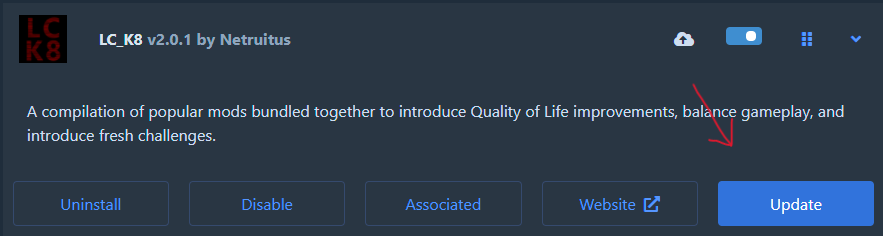

# Lethal Company - K8 Edition

Welcome to the LC K8 modpack, exclusively designed for the K8 community!

This modpack is a curated collection of popular mods (over 50!), bundled together to introduce Quality of Life changes, balance the game, and present new challenges. Enjoy the enhanced gameplay experience!

## Features

- Preconfigured
    - Disabled logging console by default
    - Mod configs adjusted for balance
- QoL changes
    - More companions! And they can be late joiners too
    - No more jumping lag
    - See directly below
    - See total value of all scrap in your ship
    - More graphic settings
    - No more limits on how much you can sell at once
    - Hear active Walkies
    - Better saving (and more items to save)
    - More accuracte stamina display
    - Intro is no more!
- Convenience features
    - Keep your items when using inverse teleporter
    - More terminal commands
    - Monitor what your companions see
    - (A little) More stamina!
    - Switch radar's target in terminal with arrows
    - Faster dropship, because time is money
    - Reserved additonal slots for flashlight and walkie
    - Touchscreen!
- UI changes
    - See voice activity (your own and your companion's)
    - Faster update for in-game clock
    - See your HP
    - Be informed about discounts!
- Fun-ctionality
    - Deja Vu flavor of Thumper chase
    - Hoarder bugs can use items now (don't give them shotgun)
    - More causes of death
    - ~~Quests!~~ Assignments!
    - More suits! More cosmetics! And your fashion choice saves too!
    - Yippee!
    - More emotes and even more emotes!
    - Coil Head might have a staring contest with you now...
    - Hear screams of your friends a bit longer
- Challenges
    - Worse weather = Better scrap
    - Some monsters can speak your friends' voices
    - Imagine masked enemies without masks and able mimicing players' behavior...
    - Some presents can be surprisingly deadly
- And Discord Rich Presence support

## Updates

Expect updates every Friday/Saturday, depending on my community's activity. Mod updates are exclusively handled by the modpack itself - click update on modpack only to sync all mods.

Updating individual mods independently may lead to further instability.

## Disclaimer

This modpack is not officially vetted for stability, and support for stability issues is not provided. Use at your own discretion and understanding.
